  

  

I am a Computer Science (Artificial Intelligence) student at Universiti Teknikal Malaysia Melaka (UTeM),
passionate about Artificial Intelligence, Machine Learning, Robotics, Data Analytics, and Software Development.

  

  

  

  

---

## About Me

* Studying for a **Bachelor of Computer Science (Artificial Intelligence) with Honours** at **Universiti Teknikal Malaysia Melaka (UTeM)**
* Passionate about **Artificial Intelligence, Machine Learning, Robotics, Data Analytics, and Software Development**
* Experienced in developing **AI-powered applications and full-stack systems** through academic projects
* Interested in building practical software solutions and applying AI to real-world problems
* Currently developing my technical skills through **academic projects, professional certifications, and hands-on practice**
* Seeking a **full-time industrial internship for 24 weeks from 28 September 2026 to 12 March 2027**
* Based in **Malaysia**
* Expected graduation: **November 2027**
* Current CGPA: **3.14/4.00**

---

## Technical Skills

### Programming

### Artificial Intelligence

### Software & Database

### Robotics

---

## Technical Projects

### AI-Based Predictive Maintenance System

Developed an AI system for anomaly detection and machine health monitoring for rotating equipment.

**Technologies:** Python, Scikit-learn, HTML, Machine Learning Models, Plotly

**Focus:** Artificial Intelligence, Anomaly Detection, Predictive Maintenance, Machine Health Monitoring

---

### MindLock Security System

Built an AI-assisted password management system focused on improving password security and user awareness.

**Technologies:** Python, HTML, SQL, Machine Learning Models

**Focus:** Artificial Intelligence, Cybersecurity, Password Security, Software Development

---

### Traffic Carbon Emission Monitoring Dashboard

Developed an interactive dashboard to monitor traffic congestion and estimate CO₂ emissions, using data visualization and environmental monitoring techniques.

**Technologies:** Python, Streamlit, Plotly, Folium, AI, Data Science

**Focus:** Data Analytics, Data Visualization, Traffic Analysis, CO₂ Emission Estimation

---

### Cinema Booking Ticket System

Built a cinema booking system with seat reservation and payment features, supported by a structured relational database.

**Technologies:** C++, MySQL

**Focus:** C++, Database Design, System Development, Booking Management

---

## Certifications

* **IBM Machine Learning Professional Certificate** — May 2026
* **Oracle Certified Foundations Associate – Database** — February 2026
* **Google Data Analytics Professional Certificate** — June 2026

---

## Education

### Universiti Teknikal Malaysia Melaka (UTeM)

**Bachelor of Computer Science (Artificial Intelligence) with Honours**

* Location: Melaka, Malaysia
* Start Date: 2023
* Expected Graduation: **November 2027**
* Current CGPA: **3.14/4.00**

---

## Areas of Interest

---

## Languages

* **Arabic**
* **English**

---

## GitHub Stats

  

  

---

## Connect With Me

  

  

  

  

  

  

